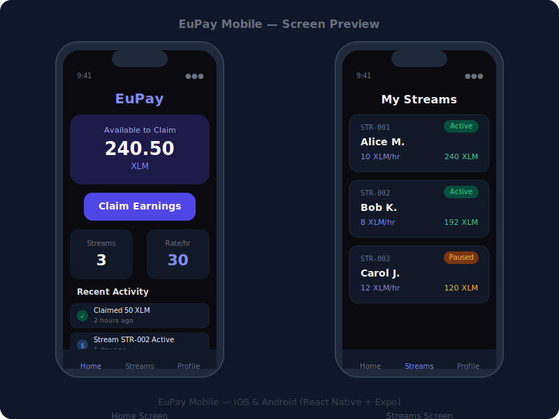

# EuPay Mobile

<div align="center">


**Payroll Streaming Mobile App — iOS & Android**

[](LICENSE)
[](https://stellar.org)
[](https://expo.dev)
[](https://reactnative.dev)

[Overview](#-overview) • [Quick Start](#-quick-start) • [Screens](#-screens) • [Contributing](#-contributing)

</div>

---

## 📖 Overview

EuPay Mobile is the iOS and Android app for the EuPay payroll protocol on Stellar. Workers can check their real-time earnings, claim salary, and manage their streams directly from their phone. Employers can monitor treasury balances and active streams on the go.


## 📸 Screenshots



---
## ✨ Features

- **Real-Time Earnings** — Watch salary accrue per second on your phone
- **One-Tap Claim** — Claim earned salary with a single tap
- **Stream Dashboard** — View all active, paused, and completed streams
- **Freighter Integration** — Connect your Stellar wallet securely
- **Cross-Platform** — Runs natively on iOS and Android via Expo

---

## 📱 Screens

| Screen | Description |
|--------|-------------|
| **Home** | Wallet connection and overview stats |
| **Streams** | List of all payroll streams with status badges |
| **Claim** | Claim earned salary from active streams |
| **History** | Transaction and payment history |

---

## 🚀 Quick Start

### Prerequisites

- Node.js 20+
- Expo CLI (`npm install -g expo-cli`)
- Expo Go app on your phone ([iOS](https://apps.apple.com/app/expo-go/id982107779) / [Android](https://play.google.com/store/apps/details?id=host.exp.exponent))

### Installation

```bash
# Clone the repository
git clone https://github.com/EuStellar-Pay/EuPay-mobile.git
cd EuPay-mobile

# Install dependencies
npm install

# Start Expo development server
npm start
```

Scan the QR code with the **Expo Go** app on your phone.

### Running on Simulator

```bash
# iOS Simulator (macOS only)
npm run ios

# Android Emulator
npm run android
```

---

## 🏗️ Architecture

```
┌─────────────────────────────────────────────┐
│         EuPay Mobile (React Native/Expo)    │
│   • Expo Router (file-based navigation)    │
│   • Freighter Mobile SDK                   │
│   • Real-time stream polling               │
└──────────────────┬──────────────────────────┘
                   │ REST API
┌──────────────────▼──────────────────────────┐
│         EuPay Backend API                   │
└──────────────────┬──────────────────────────┘
                   │ Soroban RPC
┌──────────────────▼──────────────────────────┐
│         Stellar Network                     │
└─────────────────────────────────────────────┘
```

### Technology Stack

| Layer | Technology |
|-------|-----------|
| Framework | React Native 0.76 |
| Expo SDK | 52 |
| Router | Expo Router 4 |
| Language | TypeScript 5 |
| Wallet | Freighter Mobile |

---

## 📁 Project Structure

```
app/
├── index.tsx           # Home screen — wallet connect & stats
├── streams.tsx         # Payroll streams list
├── (tabs)/
│   └── _layout.tsx     # Tab navigator layout
```

---

## 🤝 Contributing

See [Contributing Guide](../CONTRIBUTING.md).

---

## 📜 License

Apache 2.0 — see [LICENSE](LICENSE)

---

## 👥 Past Contributors

| GitHub | Role |
|--------|------|
| [@Uchechukwu-Ekezie](https://github.com/Uchechukwu-Ekezie) | Past Contributor |
| [@bakarezainab](https://github.com/bakarezainab) | Past Contributor |
| [@Gbangbolaoluwagbemiga](https://github.com/Gbangbolaoluwagbemiga) | Past Contributor |
| [@Wilfred007](https://github.com/Wilfred007) | Past Contributor |
| [@meshackyaro](https://github.com/meshackyaro) | Past Contributor |
| [@ogazboiz](https://github.com/ogazboiz) | Past Contributor |
| [@Godbrand0](https://github.com/Godbrand0) | Past Contributor |
| [@Christopherdominic](https://github.com/Christopherdominic) | Past Contributor |
| [@Olowodarey](https://github.com/Olowodarey) | Past Contributor |
| [@emdevelopa](https://github.com/emdevelopa) | Past Contributor |
| [@pope-h](https://github.com/pope-h) | Past Contributor |
| [@DeborahOlaboye](https://github.com/DeborahOlaboye) | Past Contributor |
| [@Rampop01](https://github.com/Rampop01) | Past Contributor |
| [@LaGodxy](https://github.com/LaGodxy) | Past Contributor |
| [@AbelOsaretin](https://github.com/AbelOsaretin) | Past Contributor |
| [@7maylord](https://github.com/7maylord) | Past Contributor |
| [@Jayy4rl](https://github.com/Jayy4rl) | Past Contributor |
| [@CMI-James](https://github.com/CMI-James) | Past Contributor |
| [@edehvictor](https://github.com/edehvictor) | Past Contributor |

<div align="center">

**Built with ❤️ on Stellar**

[EuStellar-Pay Organization](https://github.com/EuStellar-Pay) • [Frontend](https://github.com/EuStellar-Pay/EuPay-frontend) • [Backend](https://github.com/EuStellar-Pay/EuPay-backend) • [Smart Contracts](https://github.com/EuStellar-Pay/EuPay-smartcontract)

</div>
